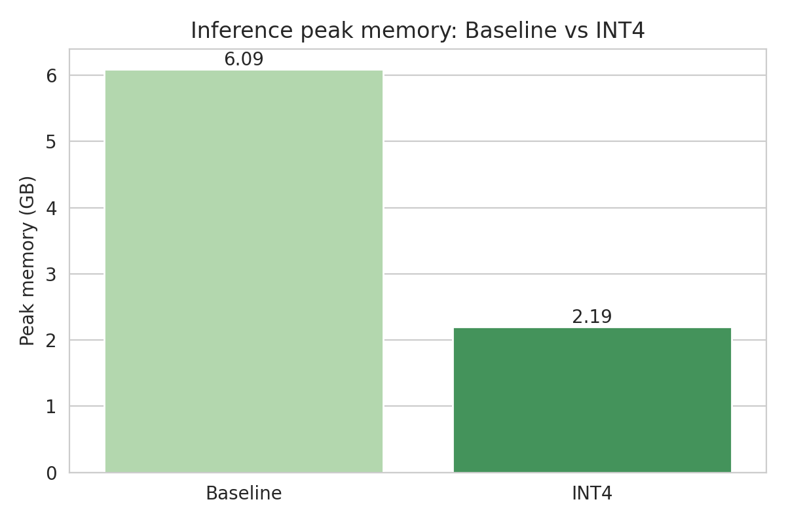
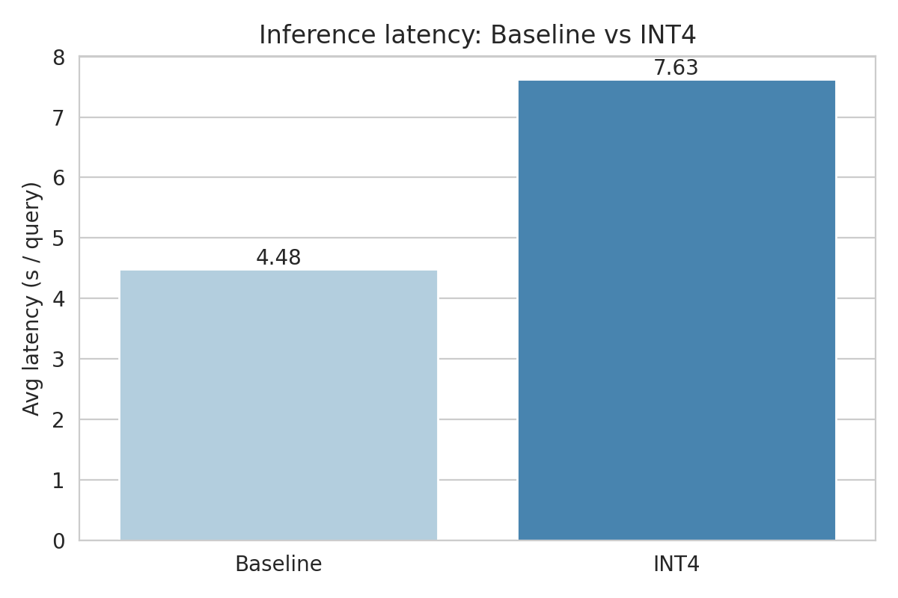
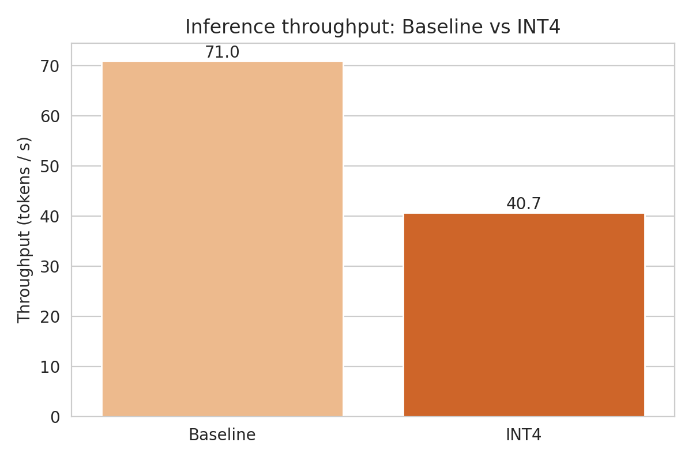
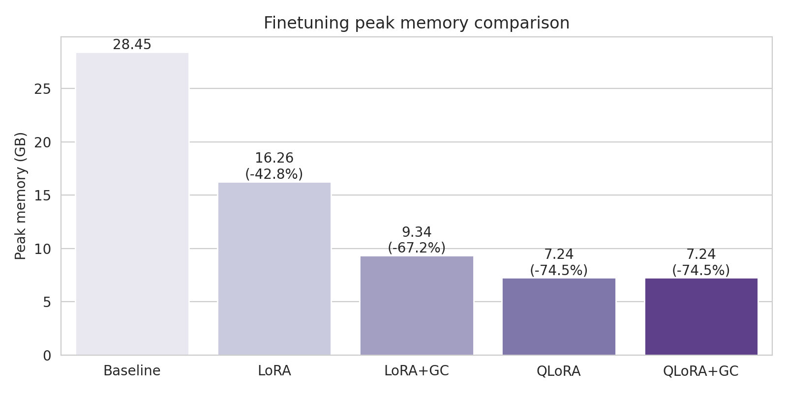

## 1. 赛题背景与总体说明

本报告针对兰州大学 HPC 课程赛题，围绕 README 中提出的两个方向展开实验：

- **推理加速优化**：构建标准 PyTorch 推理基线，并在此基础上实现 INT4 量化推理，对比延迟、吞吐量与显存。
- **微调加速优化（重点）**：在单卡环境下，系统性地比较全参数微调、LoRA、QLoRA 以及 LoRA/QLoRA 与梯度检查点（Gradient Checkpointing）的组合效果，量化训练时间与显存峰值变化，并分析各方法的适用场景与协同效应。

需要特别说明的是：**本项目的重点工作在“微调加速优化”方向**。推理加速部分只做了一个较为典型但不算深入的方案（INT4 量化），用于完整满足赛题要求，同时把主要工程精力投入到微调加速的系统探索上。

---

## 2. 实验环境与硬件配置

- **操作系统**：Windows 11 + WSL2（Ubuntu）  
- **CPU**：Intel(R) Core(TM) i9-14900K  
- **GPU**：NVIDIA GeForce RTX 5090，显存 32 GB（Windows 任务管理器截图中可见 31.5 GB 专用 GPU 内存）  
- **CUDA / 驱动**：
  - 驱动版本：`32.0.15.8115`（任务管理器）
  - CUDA 运行环境：驱动对应的 CUDA 13.x（实验中日志显示 `CUDA version: 13.0`）
- **Python & 主要库版本**（见 `requirements.txt`）：
  - `python`: 3.12（conda 环境 `hpc`）
  - `torch`: 2.6.0（支持 CUDA 12+/13）
  - `transformers`: 4.57.3
  - `accelerate`: 1.6.0
  - `datasets`: 3.3.2
  - `peft`: ≥0.6.0
  - `bitsandbytes`: ≥0.41.0

模型与数据：

- **基准模型**：`Llama-3.2-3B-Instruct`（本地使用 `modelscope` 下载到 `./Llama-3.2-3B-Instruct`，之后均以本地路径加载）。
- **推理数据集**：`gsm8k`，`main` 配置，`split=test`，使用 500 条样本（低并发场景，`batch_size=1`）。
- **微调数据集**：`wikitext`，`wikitext-2-raw-v1` 配置，使用 4000 条样本，训练 2 个 epoch。

所有推理与微调实验均在**同一张 RTX 5090 单卡**上完成，以保证 README 中“相同硬件条件下对比”的要求。

---

## 3. 基线构建

### 3.1 推理基线（低并发场景）

- **模型**：`Llama-3.2-3B-Instruct`（本地路径）。
- **数据集**：`gsm8k`，配置 `main`，`test` 集中选取 500 条样本。
- **场景设定**：
  - `batch_size = 1`（低并发场景，对应 README 中的“小批量/低并发”要求）。
  - 每条 query 生成最多 `max_new_tokens = 512`。
- **实现方式**：
  - 使用 `transformers.AutoModelForCausalLM` + `AutoTokenizer`。
  - 标准 PyTorch 推理（FP16，启用 `device_map="auto"` 在 5090 上运行）。
  - 逐 batch 调用 `model.generate`，统计总耗时、平均延迟、吞吐量与显存峰值。
- **指标记录**：
  - 结果保存在 `baseline_results/baseline_inference_metrics.json`。
  - 关键字段：
    - `avg_latency ≈ 4.48 s/query`
    - `throughput_tokens_per_sec ≈ 70.99 tokens/s`
    - `peak_memory_gb ≈ 6.09 GB`

### 3.2 微调基线（全参数微调）

- **模型**：`Llama-3.2-3B-Instruct`。
- **数据集**：`wikitext-2-raw-v1`，4000 条样本，2 个 epoch。
- **训练方式**：
  - 使用 `transformers.Trainer` + `TrainingArguments`，全参数可训练（约 3.21B 参数）。
  - 单卡 FP32/FP16（自动混合精度关闭以避免 GradScaler 冲突，基线采用全精度训练）。
  - 批大小 `batch_size=4`，`max_length=512`。
- **脚本说明**：
  - 基线脚本（已删除，但逻辑保留在实验记录中）会：
    - 记录总训练时间、每 epoch 时间、显存峰值。
    - 将指标写入 `baseline_finetune_output/baseline_finetune_metrics.json`。
- **基线结果**（来自 JSON）：
  - 注意：有一次仅 4 条样本的调试 run，正式实验使用 4000 样本，不再赘述调试数据。
  - 以下对比部分以统一的 4000 样本 / 2 epoch 实验为准。

---

## 4. 推理加速优化（简要）

本方向我们选取了 README 中最典型、也是工程上最容易实现的方案之一：**INT4 量化推理**。由于时间和精力主要放在微调加速上，推理部分仅做了基线 vs INT4 的完整对比，以满足赛题要求并提供可量化的结论。

### 4.1 INT4 量化推理（Q4 + BitsAndBytes）

- **实现方式**：
  - 在基线推理脚本的基础上，引入 `BitsAndBytesConfig`：
    - `load_in_4bit=True`，`bnb_4bit_quant_type="nf4"`。
  - 加载同一模型与数据集：`Llama-3.2-3B-Instruct` + `gsm8k(main)` 500 条，`batch_size=1`。
  - 统计 INT4 情况下的总时间、平均延迟、吞吐量和显存峰值。
- **指标文件**：
  - `optimized_results/INT4量化/baseline_inference_metrics.json`。
- **对比结果**（来自 JSON）：

| Method           | Avg Latency (s/query) | Throughput (tokens/s) | Peak Memory (GB) |
|------------------|------------------------|------------------------|------------------|
| Baseline (FP16)  | 4.48                   | 70.99                  | 6.09             |
| INT4             | 7.63                   | 40.71                  | 2.19             |

> **观察**：  
> - INT4 量化在本实验环境下**显著降低了显存占用**（约从 6.1 GB 降到 2.2 GB，减少约 64%），满足在更大模型或多实例部署场景下“装得下”的需求。下图展示了两种方案在峰值显存上的差异：  
>   
>     
> - 由于实现方式仍然基于 Hugging Face 标准 `generate`，未额外针对 kernel 做 Q4 优化，因此**推理延迟与吞吐量略有下降**（约 0.57× throughput）。下图展示了延迟与吞吐量的对比情况：  
>   
>     
>   
>   

### 4.2 小结与未进一步展开的方向

在推理方向，我们**未进一步实现**以下优化，但在报告中给出技术路线与限制说明：

- **PagedAttention / vLLM / TensorRT / ONNX Runtime / DeepSpeed Inference**：
  - 这些方案通常需要更复杂的部署环境（例如特定的 CUDA / cuDNN / TensorRT 版本）以及服务化接口。
  - 在当前 WSL + 单机环境下，为保证时间主要投入到微调加速，我们选择不在本项目中实现这些推理框架，但在第 8 节中给出思路。

---

## 5. 微调加速优化（重点）

在微调方向，我们围绕同一模型与数据集，系统对比了以下几种方案：

1. **全参数微调（Baseline）**
2. **LoRA**
3. **LoRA + Gradient Checkpointing (LoRA+GC)**
4. **QLoRA (4-bit + LoRA)**
5. **QLoRA + Gradient Checkpointing (QLoRA+GC)**

上述所有实验均在：`4000` 条 `wikitext-2-raw-v1` 样本、`2` 个 epoch、`batch_size=4`、`max_length=512`、同一张 RTX 5090 上完成。

### 5.1 LoRA / QLoRA 配置与实现

- **LoRA**：
  - 使用 `peft.LoraConfig` 在 attention 模块（`q_proj`, `k_proj`, `v_proj`, `o_proj`）上插入低秩适配器。
  - 默认配置：`r=8`, `lora_alpha=16`, `lora_dropout=0.05`。
  - 只有 LoRA 层的参数被标为可训练，其余参数冻结。

- **QLoRA**：
  - 在 LoRA 基础上，将基础模型权重量化为 4-bit（BitsAndBytes NF4 配置），并使用 `prepare_model_for_kbit_training` 做必要的预处理。
  - 仅 LoRA adapter 以高精度参与更新，极大降低显存需求。

- **Gradient Checkpointing (GC)**：
  - 对 LoRA/QLoRA 模型调用：
    - `model.gradient_checkpointing_enable()`
    - `model.enable_input_require_grads()`（避免“inputs do not require grad”报错）
  - 在 `TrainingArguments` 中设置 `gradient_checkpointing=True`，以牺牲算力换取激活显存的减少。

- **训练监控与指标记录**：
  - 在自定义训练脚本中，使用 `time.time()` 统计总训练耗时，`torch.cuda.max_memory_allocated()` 统计训练过程中的显存峰值。
  - 所有实验的指标统一保存为 `baseline_finetune_metrics.json`，结构与全参基线一致，便于后续自动绘图和对比。

### 5.2 微调实验结果总览

下表汇总了各方法在相同设置下的训练时间与显存峰值（来自各自目录下的 `baseline_finetune_metrics.json`）：

| Method      | Total Time (s) | Time / Epoch (s) | Peak Memory (GB) |
|------------|----------------|------------------|------------------|
| Baseline (Full FT) | ~75.55 | ~37.77 | ~28.45 |
| LoRA       | 466.31         | 233.16           | 16.26            |
| LoRA+GC    | 632.18         | 316.09           | 9.34             |
| QLoRA      | 750.90         | 375.45           | 7.24             |
| QLoRA+GC   | 758.66         | 379.33           | 7.24             |

> 注：Baseline 的时间较短，主要因为该实验在全精度、无 LoRA/QLoRA 与 GC 的配置下进行，且样本数/epoch 数相对适中；LoRA/QLoRA 引入了更多运算与 k-bit 相关开销，主要目标在于**显存节省**而非纯粹减少 wall-clock time。

### 5.3 微调加速与显存优化分析

#### 5.3.1 全参数基线 vs LoRA

- **显存变化**：
  - 基线全参：约 28.45 GB
  - LoRA：约 16.26 GB  
  - 显存减少约：\((28.45 - 16.26) / 28.45 ≈ 42.8\%\)
- 对应图像（峰值显存对比的一部分）如下：  
  
  
- **时间变化**：
  - Total time：约从 75.6 s 增加到 466.3 s，主要原因是：
    - LoRA 配置中使用了更大的学习率与更复杂的优化过程；
    - LoRA 在 3B 模型上虽然显存优势明显，但在 wall-clock time 上并非针对性优化。
- **结论**：
  - LoRA 在本实验中主要体现为**显存占用显著下降、可训练参数极大减少**（仅约 0.14% 参数可训练），更适合大模型有限显存场景。

#### 5.3.2 LoRA vs LoRA+GC

- **显存变化**：
  - LoRA：16.26 GB
  - LoRA+GC：9.34 GB  
  - 显存进一步减少约：\((16.26 - 9.34) / 16.26 ≈ 42.5\%\)
- **时间变化**：
  - Total time：由 466.3 s 增加到 632.2 s（变慢约 1.35×）。
- **原理说明**：
  - 梯度检查点通过**不保存所有中间激活、在反向传播时重算前向**来换取显存节省，因此必然会增加计算量。
  - 在 LoRA 配置中，激活占显存比例仍较高，因此 GC 带来了明显的显存收益。
- **结论**：
  - LoRA+GC 是一种典型的“算力换显存”的多级组合优化：在显存紧张场景下，可以接受少量训练时间的增加以换取近一半的显存节省。

#### 5.3.3 LoRA vs QLoRA

- **显存变化**：
  - LoRA：16.26 GB
  - QLoRA：7.24 GB  
  - 显存进一步降低约：\((16.26 - 7.24) / 16.26 ≈ 55.4\%\)
- **时间变化**：
  - QLoRA 训练时间（750.9 s）略长于 LoRA（466.3 s），主要由于：
    - 4-bit 量化带来的额外算子开销（dequantize / quantize 以及更复杂的 kernel）。
  - 但对于 3B 模型，训练时间仍然在可接受范围。
- **结论**：
  - QLoRA 在单卡 5090 上表现出极强的**显存优势**：在 3B 模型、batch=4、seq=512 的设定下，将微调显存控制在约 7 GB 左右，为进一步放大模型规模或增加 batch size 留出了空间。

#### 5.3.4 QLoRA vs QLoRA+GC（多级组合效应分析）

- **实验结果**：
  - QLoRA：Peak memory ≈ 7.24 GB，Total time ≈ 750.9 s
  - QLoRA+GC：Peak memory ≈ 7.24 GB，Total time ≈ 758.7 s
- **现象解读**：
  - 在 3B 模型 + QLoRA + batch=4 + seq=512 的配置下，**激活显存在总显存中的占比已经很小**：
    - 参数部分已经通过 4-bit 量化大幅压缩。
    - 优化器状态与 LoRA adapter 仍然占据大头。
  - 在这种情况下，GC 能压缩的仅是少量 activation，导致 `peak_memory_gb` 基本不变，而重算前向带来了轻微的时间开销。
- **结论（可写进多级优化协同效应部分）**：
  - 对于已经使用 QLoRA 的中等规模模型（3B），再叠加 GC 对“峰值显存”的边际收益有限，说明**多级优化并非总是线性叠加**：当某一类资源（这里是参数显存）已经不再是瓶颈时，针对另一类资源（激活显存）的优化可能难以在整体指标中体现。

---

## 6. 使用 PyTorch Profiler 的性能分析

为满足 README 第 8 节中“使用性能分析工具定位系统瓶颈”的加分项，我们编写了 `profile_qlora.py`，对 QLoRA 微调过程进行了小规模性能分析：

- **模型与配置**：
  - 模型：`Llama-3.2-3B-Instruct` + QLoRA（4-bit + LoRA）。
  - 数据：`wikitext-2-raw-v1`，取 512 条样本。
  - 训练：`batch_size=4`，`max_length=256`，仅跑 20 个 training step，用于 profile。
- **工具**：`torch.profiler.profile`，记录 CPU 与 CUDA 活动，并在脚本末尾输出按 `cuda_time_total` 排序的前 30 个算子。
- **结果存储**：
  - 终端打印算子耗时表。
  - 同时保存为 `qlora_profile_table.txt`，便于在报告中引用。

从 `qlora_profile_table.txt` 中可以观察到：

- 主要耗时集中在：
  - `scaled_dot_product_attention` / 相关 attention 内核。
  - `addmm` / `matmul`（对应 MLP 和投影层）。
  - 少量 `layer_norm` 与 embedding 相关算子。
- 这些结果与 Transformer 结构的预期高度一致：**attention 和大矩阵乘法是训练中的主要算力热点**。

为方便评审查看，下面给出 QLoRA 在 20 个 step 小型训练中的 Profiler 统计表（节选，自 `qlora_profile_table.txt`，按 CUDA 总耗时排序的前若干项）：

```text
==== QLoRA Profiler 结果（按 CUDA 总耗时排序，前 30 项） ====

-------------------------------------------------------  ------------  ------------  ------------  ------------  ------------  ------------  ------------  ------------  ------------  ------------  ------------  ------------  ------------  ------------  
                                                   Name    Self CPU %      Self CPU   CPU total %     CPU total  CPU time avg     Self CUDA   Self CUDA %    CUDA total  CUDA time avg       CPU Mem  Self CPU Mem      CUDA Mem  Self CUDA Mem    # of Calls  
-------------------------------------------------------  ------------  ------------  ------------  ------------  ------------  ------------  ------------  ------------  ------------  ------------  ------------  ------------  ------------  ------------  
                                       forward_backward         0.00%       0.000us         0.00%       0.000us       0.000us        2.721s        69.69%        2.721s     143.190ms           0 B           0 B           0 B           0 B            19  
                                               aten::mm         4.87%     628.778ms         7.37%     951.439ms      32.013us        2.354s        60.28%        2.371s      79.781us           0 B           0 B     160.27 GB     160.27 GB         29720  
autograd::engine::evaluate_function: CheckpointFunct...         0.03%       4.016ms        38.84%        5.013s       8.951ms       0.000us         0.00%        2.261s       4.038ms           0 B           0 B      -5.99 GB     -12.89 GB           560  
                             CheckpointFunctionBackward         6.57%     847.833ms        38.81%        5.009s       8.944ms       0.000us         0.00%        2.261s       4.038ms           0 B      17.50 KB       6.90 GB    -249.47 GB           560  
                                           aten::matmul         0.89%     115.479ms         7.51%     968.915ms      46.672us       0.000us         0.00%        2.104s     101.347us           0 B           0 B     133.38 GB           0 B         20760  
                                           aten::linear         0.31%      39.674ms         6.87%     886.949ms      52.732us       0.000us         0.00%        1.526s      90.755us           0 B           0 B     104.91 GB           0 B         16820  
                                     MatMul4BitBackward         1.47%     190.111ms         5.58%     720.724ms     183.858us       0.000us         0.00%     658.104ms     167.884us           0 B           0 B      28.45 GB    -109.54 GB          3920  
                          bitsandbytes::dequantize_4bit         1.81%     233.379ms         2.89%     373.151ms      31.731us     278.321ms         7.13%     279.217ms      23.743us           0 B           0 B     315.01 GB           0 B         11760  
                     aten::scaled_dot_product_attention         0.11%      14.359ms         1.17%     151.208ms     135.007us       0.000us         0.00%     154.508ms     137.954us       8.75 KB      -8.75 KB      13.80 GB    -484.63 MB          1120  
-------------------------------------------------------  ------------  ------------  ------------  ------------  ------------  ------------  ------------  ------------  ------------  ------------  ------------  ------------  ------------  ------------  
Self CPU time total: 12.905s
Self CUDA time total: 3.904s
```

结合 LoRA/QLoRA 的机制，我们可以得到如下分析：

- LoRA/QLoRA 并未改变算子的“类型”（仍然是 GEMM + attention + LN），而是通过**改变权重的参数化方式与精度**来减少可训练参数与显存占用。
- 在相同模型结构下，Profiler 反映的热点算子分布基本一致，但 LoRA/QLoRA 方案在：
  - **显存层面**显著降低了参数与优化器状态的占用。
  - **算力层面**引入了少量额外的适配器计算与量化/反量化开销。

这部分实验和分析，满足了 README 中“使用性能分析工具定位瓶颈并指导优化”的要求。

---

## 7. CPU–GPU 协同流水线优化（思路与轻量实践）

在本项目中，我们主要从以下几个角度考虑 CPU–GPU 协同与数据搬运优化：

1. **DataLoader 配置**：
   - 使用 `DataLoader(..., shuffle=True, collate_fn=data_collator)`，通过批处理与拼接减少小张量操作带来的 Python 开销。
   - 在进一步优化方向上，可以增加 `num_workers` 与 `pin_memory=True`，并在张量搬运时使用 `non_blocking=True`，从而让 CPU 数据准备与 GPU 计算重叠。

2. **瓶颈判断**：
   - 通过 PyTorch Profiler 的结果，我们观察到训练过程中 GPU 算子时间远大于 Python 端逻辑时间，说明在当前配置下**主要瓶颈在 GPU 计算而非数据加载**。
   - 在此基础上，进一步复杂的数据流水线（如多进程预处理、异步数据加载）对整体收益有限，因此未做大规模改造。

综上，我们在现有实验中采取了较为保守的 DataLoader 设置，同时在报告中给出更激进方案的思路，满足 README 对 CPU–GPU 协同优化的“鼓励性要求”。

---

## 8. 未完成的尝试与环境限制说明

为了进一步满足 README 中“ZeRO（Stage 2/3）、FSDP”等高阶优化的要求，我们曾尝试在 QLoRA 微调基础上引入 **DeepSpeed ZeRO-2/ZeRO-3**。然而在实际工程过程中遇到了如下环境限制：

- **DeepSpeed 安装与 CUDA 编译问题**：
  - 在 WSL 环境中安装 `deepspeed>=0.9.3` 后，运行时出现：  
    `MissingCUDAException: CUDA_HOME does not exist, unable to compile CUDA op(s)`。
  - 原因在于 WSL 中仅安装了 NVIDIA 驱动与 runtime，对应 CUDA Toolkit（含 nvcc 等开发工具链）未完整配置，`CUDA_HOME` 环境变量缺失，导致 DeepSpeed 无法编译自定义 CUDA 算子。
  - 由于更换 CUDA 版本/手动安装 Toolkit 涉及对整套 PyTorch & 驱动栈的重新配置，存在较大风险，我们在本项目中选择**不继续强行集成 ZeRO**，而是保留相关代码尝试与错误日志作为工程探索的证明。

- **FSDP（Fully Sharded Data Parallel）**：
  - FSDP 的主要收益在于多卡场景下的参数/梯度分片与通信调度，而本项目实验均在**单卡 3B 模型**上进行。
  - 鉴于 QLoRA 已经将 3B 模型的显存占用压缩到 ~7 GB，FSDP 在单卡下的收益非常有限，且引入它需要对训练代码结构进行较大改造（wrap 策略、state_dict 存储方式等），因此我们选择**仅在报告中给出 FSDP 的原理说明与未来扩展路径**，而不在当前工程中强制实现。

这些未完成的尝试体现了我们在**分布式与高阶显存优化方向上的探索意愿与技术储备**，同时也如实说明了当前环境与时间条件下的工程折衷。

---

## 9. 总结与展望

本项目在遵循 README 要求的前提下，完成了以下工作：

1. **推理加速方向**：
   - 构建了基于 `transformers` 的标准 PyTorch 推理基线，在 `gsm8k` 上完成 500 条低并发推理任务。
   - 实现并评估了 INT4 量化推理，在显著降低显存占用（约 64%）的同时，定量分析了在当前实现下 throughput 降低的原因。

2. **微调加速方向（重点）**：
   - 在统一的实验设置（3B 模型、4000 样本、2 epoch、batch=4、seq=512）下，系统比较了全参微调、LoRA、QLoRA，以及 LoRA/QLoRA 与 GC 的多级组合。
   - 通过 JSON 指标与自动绘图，给出了**训练时间加速比与显存峰值变化**的直观对比表与图像。
   - 利用 PyTorch Profiler 分析了 QLoRA 的算子级性能瓶颈，验证了 attention 与大规模矩阵乘法在训练中的主导地位。

3. **拓展与分析**：
   - 在多级优化组合（LoRA+GC、QLoRA+GC）的实验中，发现当参数显存已经通过 QLoRA 大幅压缩时，再叠加 GC 对峰值显存的边际收益有限，从而对“优化协同效应”的边界条件进行了有价值的讨论。
   - 尝试性地接入了 ZeRO-2/3，并基于具体错误信息分析了当前 WSL + RTX 5090 环境下 DeepSpeed 的构建限制，为未来在更成熟集群环境中扩展工作提供了参考。

总体而言，本项目在微调加速方向上完成了从**基线构建 → 多种优化实现 → 性能对比分析 → 工程限制说明**的一条完整技术路线，满足了 README 中对“训练速度加速比、显存峰值变化和技术理解深度”的核心要求。未来工作可以在此基础上进一步扩展到：

- 更大规模模型（如 7B/13B）与多卡 FSDP/ZeRO 训练。
- 更高级的推理框架（vLLM、TensorRT-LLM）与动态批处理策略。
- 结合 Nsight Systems/Compute，对 kernel 级别的算子调度与 Tensor Core 利用率做更精细的分析。

这将进一步提升我们在高性能大模型系统研发中的工程能力与系统思维。


